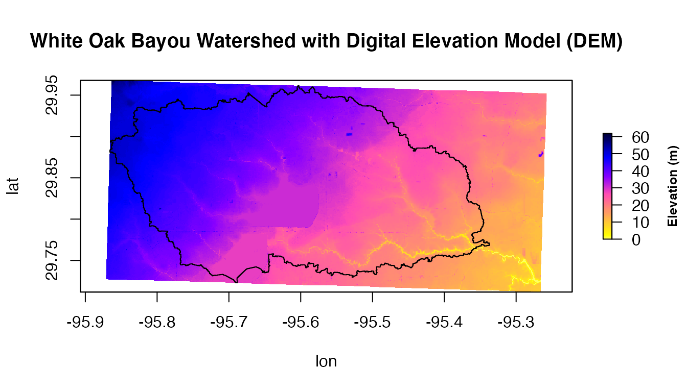
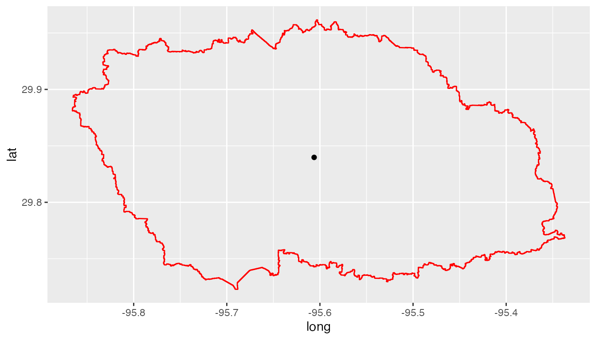

===============================
NASAaccess R Guide
===============================

Prerequisites
*************

On a local machine the user should have installed the following programs as well as setting up a user account.  The list below gives a summary of what is needed to be done prior to work with NASAaccess software on any local machine:

  * `Installing R software <https://cloud.r-project.org/>`_

  *	`Installing Rstudio software <https://www.rstudio.com/>`_ (OPTIONAL)

  * NASAaccess R package needs a user registration access with `Earthdata <https://earthdata.nasa.gov/>`_. Users should set up a registration account(s) with `Earthdata <https://earthdata.nasa.gov/>`_ login as well as well as authorizing `NASA <https://www.nasa.gov/>`_ `GES DISC <https://disc.gsfc.nasa.gov/>`_ data access.  Please refer to https://disc.gsfc.nasa.gov/data-access for further details.

  * After registration with `Earthdata <https://earthdata.nasa.gov/>`_ NASAaccess software package users should create a reference file (*netrc*) with `Earthdata <https://earthdata.nasa.gov/>`_ credentials stored in it to streamline the retrieval access to `NASA <https://www.nasa.gov/>`_ servers.

      * Creating the *.netrc* file at the user machine *Home* directory and storing the user `NASA <https://www.nasa.gov/>`_ `GES DISC <https://disc.gsfc.nasa.gov/>`_ logging information in it is needed to execute the NASAaccess package commands. Accessing data at NASA servers is further explained at `NASA earth data wiki <https://wiki.earthdata.nasa.gov/display/EL/How+To+Access+Data+With+cURL+And+Wget>`_.

      * For Windows users the `NASA <https://www.nasa.gov/>`_ `GES DISC <https://disc.gsfc.nasa.gov/>`_ logging information should be saved in a file *\_netrc* beside the *.netrc* file explained above.

  * Installing `curl <https://curl.se/>`_ software .  Since Mac users have `curl <https://curl.se/>`_ as part of macOS build, Windows users should make sure that their local machines build have `curl <https://curl.se/>`_ installed properly.

  * Checking if you can run `curl <https://curl.se/>`_ from your command prompt.  Type `curl --help` and you should see the help pages for the `curl <https://curl.se/>`_ program once everything is defined correctly.

Curl installation on Windows
*****************************

Here are some instructions that might help in installing curl on Windows OS machines:

    #. Define `%HOME%` variable in your Environment Variables by picking any directory you want to be referenced as your `HOME` directory.

    #. Create _ntrc file in your home directory. Run these commands in your command prompt.

          .. code-block::

                   cd %HOME%
                   echo. > _netrc
                   echo "machine urs.earthdata.nasa.gov login <uid> password <password>" >>  _netrc
                   #(where <uid> is your user name and <password> is your Earthdata Login password without the brackets)
                   echo. > .urs_cookies

    #. Open your _netrc file by any text editor and remove the quotations before machine and after your password. The _netrc file should be without any quotation marks to get the curl working. The _netrc/.netrc file should look like

    .. figure::  images/netrc.png
          :scale: 50%
          :align: center
          :alt: netrc file layout

    #. Download the 'curl' with the right built for your machine from https://curl.haxx.se/.

    #. Unpack the zip file in a location at your discretion.

    #. Add the curl.exe file location to your Environment Variables. Once you unpack the zip file you will find the curl.exe file in bin folder.

    #. Close the Environment Variables and check if you can run curl from your command prompt. Type curl --help and you should see the help pages for the curl program once everything is defined correctly.

NASAaccess R Package Installation
*********************************

Within Rstudio or R terminal run the following commands to install NASAaccess:

      .. code-block::

          library(devtools)
          install_github("nasa/NASAaccess", build_vignettes = TRUE)
          library(NASAaccess)

Within the Rstudio help tab the user can verify that the package has been installed and browse the help pages of the various functions of NASAaccess.

Getting Started with the NASAaccess R package
*********************************************

NASAaccess R package has multiple functions such as `GPMpolyCentroid`, `GPMswat`, and `NEX_GDPP_CMIP6` that download, extract, and reformat rainfall remote sensing and climate change data from `NASA servers <https://gpm.nasa.gov/data/directory>`_ for grids within a specified watershed shapefile.

Let's explore `GPMpolyCentroid` function at an example watershed near Houston, TX.

     .. code-block::

          library(ggmap)
          library(raster)
          library(ggplot2)
          library(rgdal)

          #Reading input data
          dem_path <- system.file("extdata",
                        "DEM_TX.tif",
                        package = "NASAaccess")

          shape_path <- system.file("extdata",
                          "basin.shp",
                          package = "NASAaccess")

           dem <- raster(dem_path)

           shape <- readOGR(shape_path)

           shape.df <- ggplot2::fortify(shape)

           #plot the watershed data
           myMap <- get_stamenmap(bbox = c(left = -96,
                                bottom = 29.7,
                                right = -95.2,
                                top = 30),
                                            maptype = "terrain",
                                            crop = TRUE,
                                             zoom = 10)

           ggmap(myMap) +
                          geom_polygon(data = shape.df,
                                aes(x = long, y = lat, group = group),
                                fill = NA, size = 0.5, color = 'red')

.. figure::  images/unnamed-chunk-2-1.png
   :scale: 50%
   :align: center
   :alt: White Oak Bayou watershed

   The geographic layout of the White Oak Bayou watershed. Whiteoak Bayou is a tributary for the Buffalo Bayou River (Harris County, Texas).

In order to use NASAaccess we also need a digital elevation model (DEM) raster layer. Let’s see the White Oak Bayou watershed DEM and a more closer look at the study watershed example.

    .. code-block::

          plot(dem,
                main="White Oak Bayou Watershed with Digital Elevation Model (DEM)",
                    col=rev(bpy.colors()),
                    xlab='lon',
                    ylab='lat',
                    legend  = T,
                    legend.args=list(text='Elevation (m)',
                       side=4,
                       font=2,
                       line=2.5,
                       cex=0.8))

          plot(shape , add = TRUE)

   The White Oak Bayou watershed with Digital elevation model in meters.

Now, let’s examine `GPMpolyCentroid` function.

    .. code-block::

             GPMpolyCentroid(Dir = "./GPMpolyCentroid/",
                               watershed = shape_path,
                               DEM = dem_path,
                               start = "2019-08-1",
                               end = "2019-08-3")

Examining the rainfall station file generated by `GPMpolyCentroid`

    .. code-block::

            GPMpolyCentroid.precipitationMaster <- system.file('extdata/GPMpolyCentroid',
                                                    'precipitationMaster.txt',
                                                    package = 'NASAaccess')

            GPMpolyCentroid.precipitation.table <- read.csv(GPMpolyCentroid.precipitationMaster)

            #plotting
            ggplot() +
                        geom_polygon(data = shape.df,
                                    aes(x = long, y = lat, group = group),
                                    fill = NA,
                                    colour = 'red') +
                        geom_point(data=GPMpolyCentroid.precipitation.table,
                                    aes(x=LONG,y=LAT))

    The White Oak Bayou watershed with GPM remote sensing data.

We note here that GPMpolyCentroid has given us the `GPM <https://gpm.nasa.gov/data/imerg>`_ data grid that falls within a specified watershed and assigns a pseudo rainfall gauge located at the centroid of the watershed a weighted-average daily rainfall data.

More examples on NASAaccess functionalities can be found `Here <https://imohamme.github.io/NASAaccess/articles/About.html>`_.
